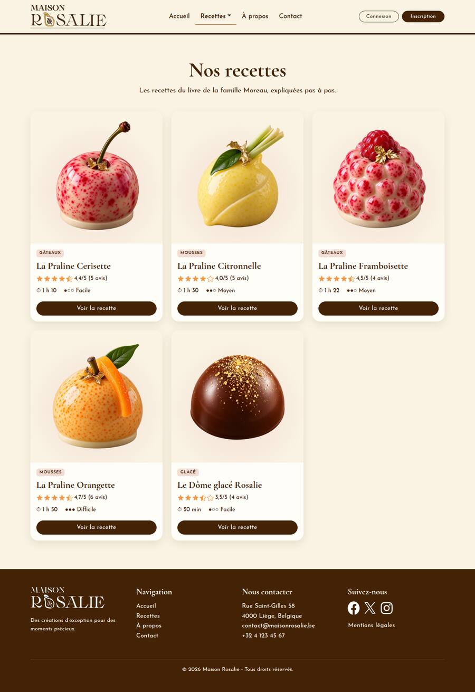
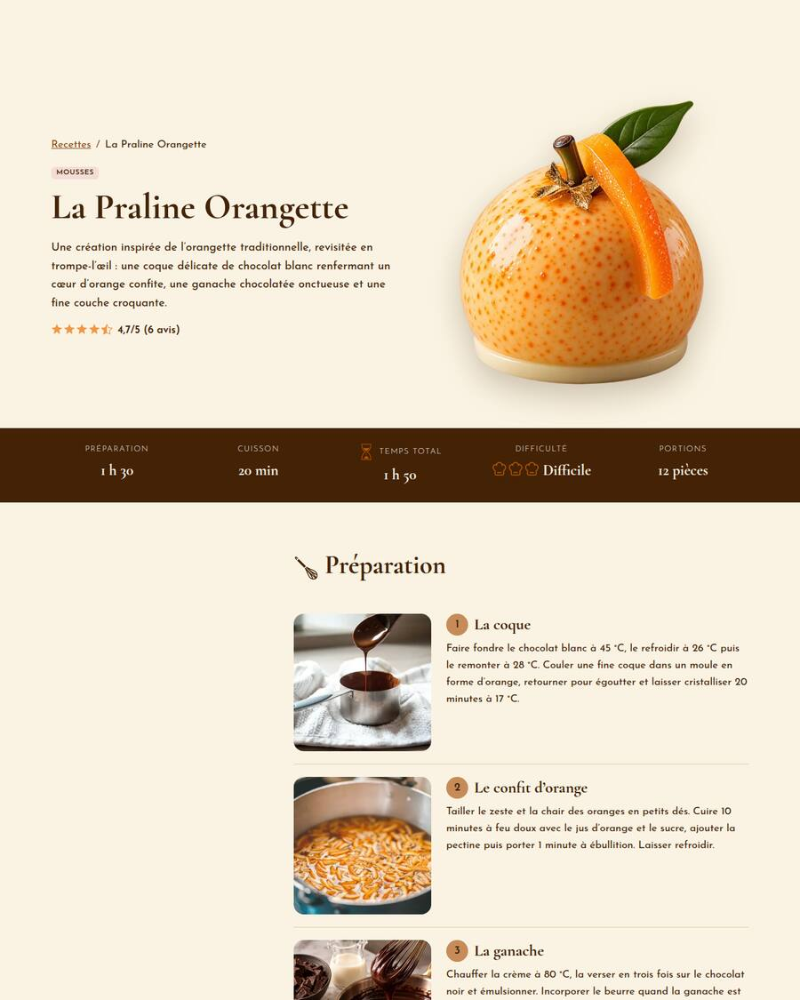
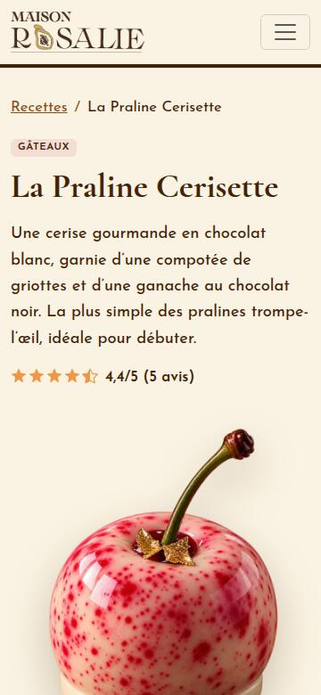

# La Maison Rosalie — le livre de recettes au chocolat

Site web dynamique de la Maison Rosalie, chocolaterie belge fondée en 1987 par la famille Moreau :
chaque visiteur peut lire une recette pas à pas, la noter en étoiles et laisser un commentaire.

| Accueil | Recettes | Recette | Mobile (360 px) |
|---|---|---|---|
|  |  |  |  |

## Choix techniques

| Couche | Choix | Raison |
|--------|-------|--------|
| Structure | HTML5 sémantique | imposé |
| Style | Bootstrap 5.3 (CDN jsDelivr, avec contrôle d'intégrité SRI) + `public/assets/css/style.css` | imposé ; notre CSS ne fait qu'ajouter l'identité de la marque |
| Interactions | JavaScript natif en modules ES (`public/assets/js/`) | imposé, sans framework |
| Backend | **PHP 8.2+ orienté objet**, sans framework | même organisation que le cours PHP OO : namespaces, autoload PSR-4, hydratation, managers PDO, enums, exceptions |
| Base de données | MySQL 8 ou MariaDB 10.5+ | contraintes `CHECK`, clés étrangères `ON DELETE CASCADE` |

Bibliothèques supplémentaires : uniquement **Google Fonts** (2 familles, voir plus bas). Aucune autre dépendance.

## Installation pas à pas

Prérequis : PHP 8.2 ou plus récent avec l'extension `pdo_mysql`, et MySQL ou MariaDB.

1. **Créer la base et les données de démonstration** (le script peut être rejoué à volonté : il recrée tout) :
   ```sh
   mysql -u root -p < data/maison_rosalie.sql
   ```
2. **Créer le compte dédié au site**, avec des droits limités aux données (remplacer d'abord le mot de passe dans le fichier) :
   ```sh
   mysql -u root -p < data/create_app_user.sql
   ```
3. **Configurer** : copier `config.example.php` en `config.php` (ce fichier est ignoré par Git) et y reporter le même mot de passe.
4. **Lancer le site** :
   ```sh
   php -S localhost:8000 -t public
   ```
   puis ouvrir <http://localhost:8000>. Avec XAMPP/WAMP, faire pointer le site (DocumentRoot) sur le dossier `public/` : seul ce dossier doit être accessible depuis le web.
5. **Vérifier** (facultatif) : `php tests/api-test.php http://localhost:8000` rejoue 48 tests de l'API.

## Comptes de test

| Rôle | Nom d'utilisateur | E-mail | Mot de passe |
|------|-------------------|--------|--------------|
| Administrateur | admin_rosalie | admin@maisonrosalie.be | `Rosalie#Admin2026` |
| Inscrit | claire, julien, sofia, marc, lea, hugo | `<nom>@exemple.be` (ex. claire@exemple.be) | `Chocolat2026!` |

L'administrateur peut supprimer n'importe quel commentaire.

## Organisation du code

```text
├── autoload.php            auto-chargement PSR-4 (spl_autoload_register)
├── bootstrap.php           initialisation commune : config, erreurs, autoload, session
├── config.example.php      modèle de configuration sans secret
├── controller/App/Controller/
│   ├── AbstractController.php, PageController.php     pages HTML
│   └── Api/                                           API JSON (Auth, Recipe, Rating, Comment, Contact)
├── model/App/
│   ├── Core/       Database (connexion unique), Session, View, JsonResponse, Validator, Logger
│   ├── Model/      AbstractModel (hydratation) + User, Recipe, RecipeIngredient, Step, Comment, ContactMessage
│   │   └── Enum/   Difficulty, Role
│   ├── Manager/    AbstractManager + un manager par table (toutes les requêtes SQL sont ici)
│   └── Exception/  HttpException et ses filles (NotFound, Unauthorized, Forbidden, Validation, TooManyRequests)
├── view/           gabarit et pages : affichage uniquement, aucun accès aux données
├── public/         seul dossier exposé : index.php (pages), api.php (API), assets/
├── data/           script d'import unique + création du compte MySQL dédié
├── docs/           API.md, PLAN-DE-TESTS.md, captures d'écran
├── tests/          tests automatisés de l'API
└── logs/           journal des erreurs techniques (ignoré par Git)
```

Principe, comme dans le cours :

- chaque **table** est représentée par une **classe** (`Recipe`, `User`…) qui hérite d'`AbstractModel` : le constructeur reçoit une ligne PDO et appelle les setters correspondants (`prep_time_minutes` → `setPrepTimeMinutes()`) ;
- chaque **manager** reçoit sa connexion PDO (injection de dépendance) et ne fait que des requêtes préparées ;
- les **contrôleurs** valident les données reçues (`Validator`), appellent les managers et choisissent la réponse ; une **exception** (`NotFoundException`, `ValidationException`…) porte le code HTTP et le message montré au visiteur ;
- les **vues** n'affichent que ce qu'on leur donne, toujours échappé avec `View::e()`.

Pages : `index.php` (accueil), `index.php?page=recettes`, `?page=recette&slug=…`, `?page=a-propos`, `?page=contact`.
La connexion et l'inscription se font dans des fenêtres modales, disponibles sur toutes les pages.
L'API est documentée dans [docs/API.md](docs/API.md).

## Identité visuelle

- **Palette** : brun chaud `#432205` (textes, navigation, pied de page), caramel `#C68B59` / `#8A4B14` (accents, liens), rose poudré `#F3DDD5` (sections), crème `#FAF3E3` (fond). Les textes respectent un contraste suffisant sur chaque fond.
- **Typographies** (2 familles, via Google Fonts) : *Cormorant Garamond* pour les titres, *Josefin Sans* pour le texte.
- **Composants** : boutons arrondis brun / caramel, cartes de recettes (photo, catégorie, note, temps, difficulté), étoiles de notation, modales de connexion et d'inscription.
- **Logo** : PNG à fond transparent, utilisé dans la navigation, le hero et le pied de page.
- **Images** : WebP compressées (toutes sous 140 Ko), chargement différé des images hors écran.

## Sécurité

| Exigence | Mesure |
|----------|--------|
| Injection SQL | requêtes préparées partout (`PDO::ATTR_EMULATE_PREPARES` désactivé) |
| XSS | `htmlspecialchars` à l'affichage PHP, `textContent` en JavaScript, en-tête `X-Content-Type-Options` |
| CSRF | jeton de session envoyé dans l'en-tête `X-CSRF-Token` pour toute requête qui modifie des données |
| Mots de passe | `password_hash()` (bcrypt), politique : 10 caractères min., une lettre et un chiffre |
| Connexion | message identique que l'e-mail existe ou non, temps de réponse identique, blocage 15 min après 5 échecs par e-mail ou 20 par IP |
| Session | cookie HttpOnly + SameSite=Lax (+ Secure en HTTPS), identifiant renouvelé à la connexion, expiration après 2 h d'inactivité, déconnexion qui détruit la session |
| Contrôle d'accès | vérifié côté serveur sur chaque action (connecté, auteur, administrateur) |
| Validation | toutes les données sont revalidées côté serveur, la validation JavaScript n'est qu'un confort |
| Base | contraintes `UNIQUE`, `CHECK` (note de 1 à 5, longueur des commentaires…) et clés étrangères ; compte MySQL dédié sans droit sur la structure |
| Erreurs | aucune erreur technique affichée : message générique pour le visiteur, détails dans `logs/app.log` |
| Secrets | `config.php` hors du dépôt et hors du dossier public ; seul `config.example.php` est versionné |
| Spam | champ piège, délai minimum et limite d'envois sur le contact ; 5 commentaires max. par 10 minutes |

**Avant une mise en ligne réelle** : servir le site en HTTPS uniquement, définir un vrai mot de passe pour le compte MySQL dédié, ajouter les en-têtes `Content-Security-Policy` et `Strict-Transport-Security`, mettre en place des sauvegardes de la base et une rotation de `logs/`, envoyer un e-mail de confirmation à l'inscription et proposer la réinitialisation du mot de passe.

## Recettes

| N° | Recette | Catégorie | Développeur | Difficulté |
|----|---------|-----------|-------------|------------|
| 1 | La Praline Orangette | Mousses | | Difficile |
| 2 | La Praline Citronnelle | Mousses | | Moyen |
| 3 | La Praline Cerisette | Gâteaux | | Facile |
| 4 | La Praline Framboisette | Gâteaux | | Moyen |
| 5 | Le Dôme glacé Rosalie | Glacé | | Facile |

> ⚠️ **À compléter par l'équipe** : la colonne « Développeur », et les photos d'étapes. Le cahier des charges demande une photo prise pendant la réalisation pour chaque étape. Pour l'instant, plusieurs étapes réutilisent les visuels de la maquette Figma (par exemple, la même photo de coque pour les quatre pralines). Il suffit de déposer les nouvelles photos dans `public/assets/img/recipes/steps/` et de mettre à jour la colonne `image` de la table `steps` dans `data/maison_rosalie.sql`.

## Documents

- [Documentation de l'API](docs/API.md)
- [Plan de tests](docs/PLAN-DE-TESTS.md)
- `data/maison_rosalie_v1.sql` : modèle de données initial de l'équipe (MySQL Workbench), dont est dérivé le script d'import `data/maison_rosalie.sql`.
